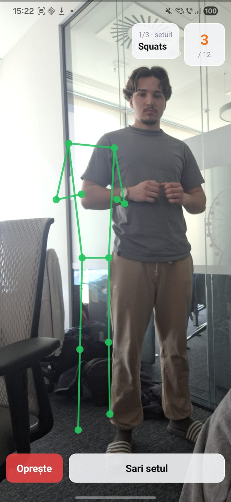
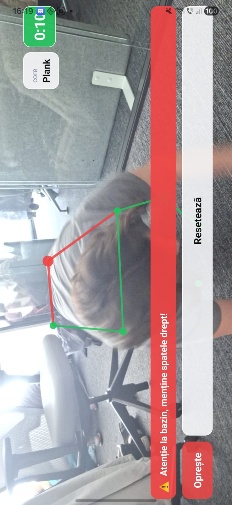
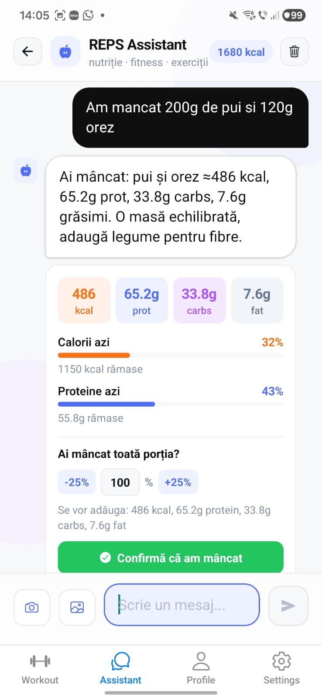
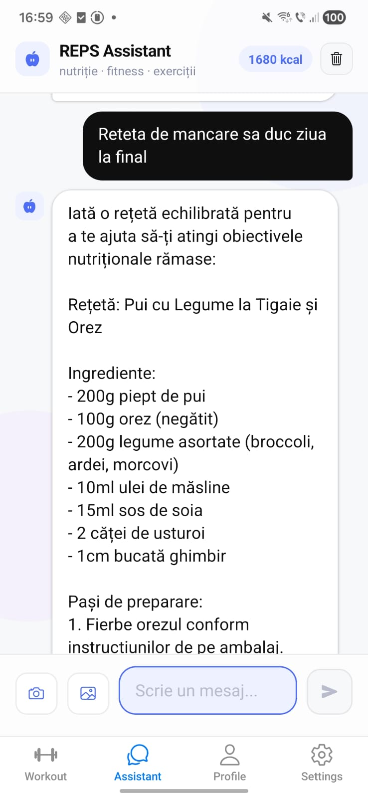
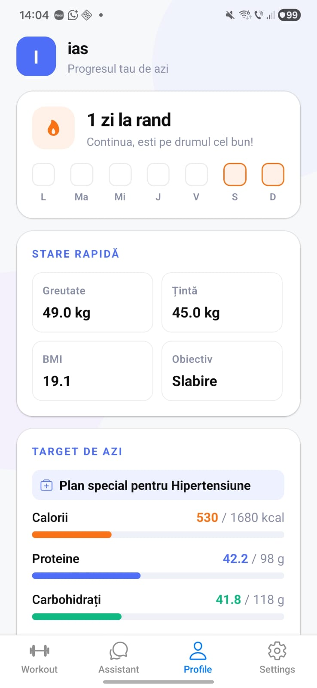
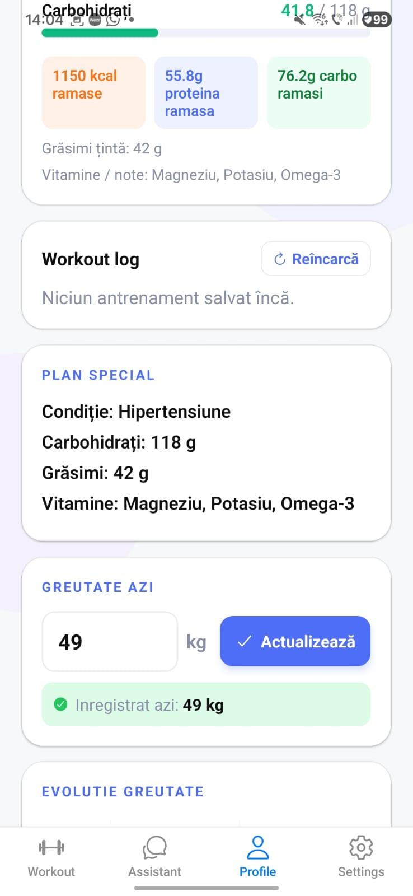
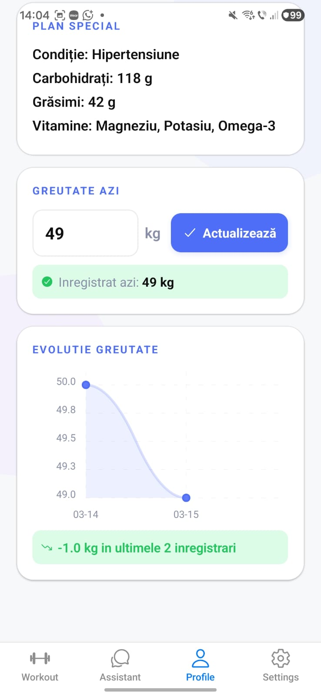

# REPS - AI-Powered Fitness & Nutrition Tracker 🏋️‍♂️🥗


## 📖 About The Project
**REPS** solves the problem of fragmented health tracking. Instead of using one app for calorie counting and another for workouts, REPS unifies them using Artificial Intelligence. It features an AI-powered motion tracker to validate workout forms and an intelligent AI Assistant that logs food, calculates macros, and generates personalized recipes based on user goals, age, and medical conditions.

## ✨ Key Features
* **🤖 AI Motion Tracking:** Uses device camera to track body joints in real-time. It automatically counts reps and provides instant feedback on posture (e.g., warning the user to keep their back straight during planks).
* **🍏 Smart Nutrition Assistant (Powered by Gemini):** Log your meals using natural language (e.g., "I ate 200g of chicken and 120g of rice"). The AI automatically extracts calories, proteins, carbs, and fats, adding them to your daily target.
* **👨‍🍳 Personalized Recipe Generator:** Ask the AI for a meal plan to fill your remaining daily macros, taking into account specific medical conditions (e.g., hypertension).
* **📊 Analytics Dashboard:** Track your daily streaks, weight evolution (with graphs), BMI, and macro targets.
* **🔐 User Authentication:** Secure login and user data storage.

## 📱 Screenshots & Demo

<p align="center">
  A visual tour of the REPS application, from AI form tracking to the smart nutrition assistant.
</p>

<table border="0">
  <tr>
    <td align="center" valign="top" colspan="2">
      <h3>🤖 AI-Powered Exercise Form Tracking</h3>
    </td>
  </tr>
  <tr>
    <td align="center">
      
      <br><em>Form Validation (Squats)</em>
    </td>
    <td align="center">
      
      <br><em>Form Correction (Planks)</em>
    </td>
  </tr>

  <tr>
    <td align="center" valign="top" colspan="2">
      <br><h3>🍏 Smart Nutrition & Recipe Assistant</h3>
    </td>
  </tr>
  <tr>
    <td align="center">
      
      <br><em>Food Logging & Macros</em>
    </td>
    <td align="center">
      
      <br><em>AI Recipe Generator</em>
    </td>
  </tr>

  <tr>
    <td align="center" valign="top" colspan="2">
      <br><h3>📊 User Dashboard & Progress Tracking</h3>
    </td>
  </tr>
  <tr>
    <td align="center" colspan="2">
      &nbsp;&nbsp;&nbsp;&nbsp;
      &nbsp;&nbsp;&nbsp;&nbsp;
      
      <br><em>Overview, Weight Tracking, BMI</em>
    </td>
  </tr>
</table>

## 🛠️ Tech Stack
* **Frontend:** React Native
* **Motion Tracking / Computer Vision:** MediaPipe Pose
* **AI & NLP:** Google Gemini API
* **Backend & Database:** Firebase (Authentication, Firestore)

## 🚀 How to Run Locally

To get a local copy up and running, follow these simple steps:

### Prerequisites
* **Node.js** installed on your machine.
* **Android Studio & Android SDK** configured on your machine.
* A physical Android device or an Android Emulator. 
*(Note: The standard Expo Go app is not supported due to the use of custom native libraries).*

### Installation

1. **Clone the repository:**
   `git clone https://github.com/PetricaZPC/reps.git`

2. **Navigate to the project directory:**
   `cd reps`

3. **Install dependencies:**
   `npm install`

4. **Set up Environment Variables:**
   Create a `.env` file in the root directory of the project and add your API keys. Make sure this file matches the following structure:
   ```env
   EXPO_PUBLIC_GEMINI_API_KEY=your_gemini_api_key

   API_KEY=your_firebase_api_key
   AUTH_DOMAIN=your_firebase_auth_domain
   PROJECT_ID=your_firebase_project_id
   STORAGE_BUCKET=your_firebase_storage_bucket
   MESSAGING_SENDER_ID=your_messaging_sender_id
   APP_ID=your_firebase_app_id
   MEASUREMENT_ID=your_measurement_id

   EXPO_PUBLIC_API_KEY=your_expo_firebase_api_key
   EXPO_PUBLIC_AUTH_DOMAIN=your_expo_firebase_auth_domain
   EXPO_PUBLIC_PROJECT_ID=your_expo_firebase_project_id
   EXPO_PUBLIC_STORAGE_BUCKET=your_expo_firebase_storage_bucket
   EXPO_PUBLIC_MESSAGING_SENDER_ID=your_expo_messaging_sender_id
   EXPO_PUBLIC_APP_ID=your_expo_firebase_app_id
   EXPO_PUBLIC_MEASUREMENT_ID=your_expo_measurement_id
   ```

5. **Start the Expo server:**
`npx expo start`

6. **Run the application:**
Because this app uses native modules (such as MediaPipe for AI motion tracking) that are not supported by Expo Go, it must be compiled as a development build. Additionally, this project is currently configured for Android only.

Open a new terminal window in the project folder and run:
`npx expo run:android`

